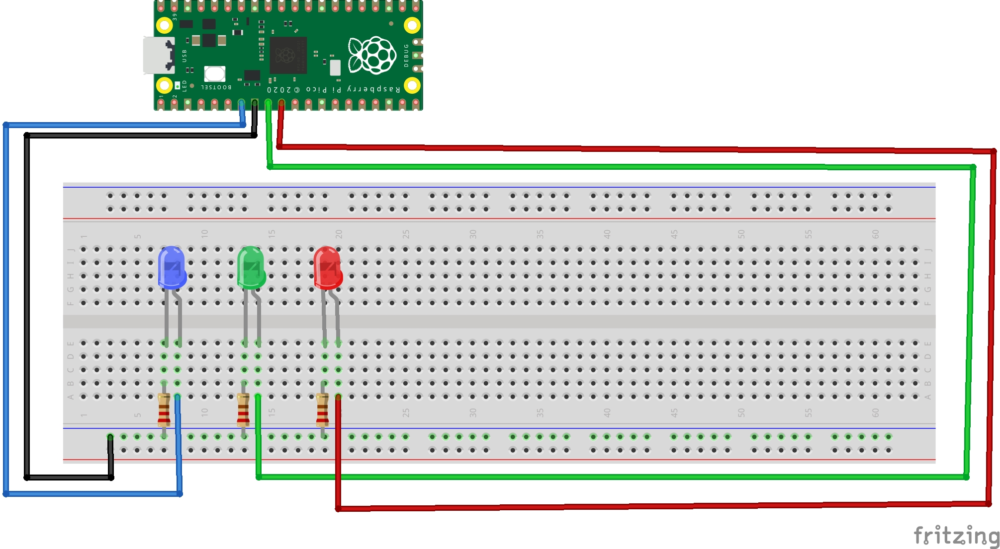

# Temperature-RPI
Temperature reading project, that outputs information into a led, using the raspberry pi pico internal, temperature sensor.

## Circuit


## Code
### Pre-requisities
- pico sdk
- cmake
- pico board, 4 leds, 4 220Ω

## How to run the code

1 - Create a build directory and cd into it.
```bash
$ mkdir build && cd build
```
2 - Configure using cmake.
```bash
$ cmake ..
```
3 - Build the Code.
```bash
$ make
```
4 - Plug your raspberry pi pico in storage unit mode, this can be done by holding the Bootsel button while connecting the board to the usb.

5 - Copy the ``temperature.uf2`` in the ``build folder`` to the raspberry pi.
